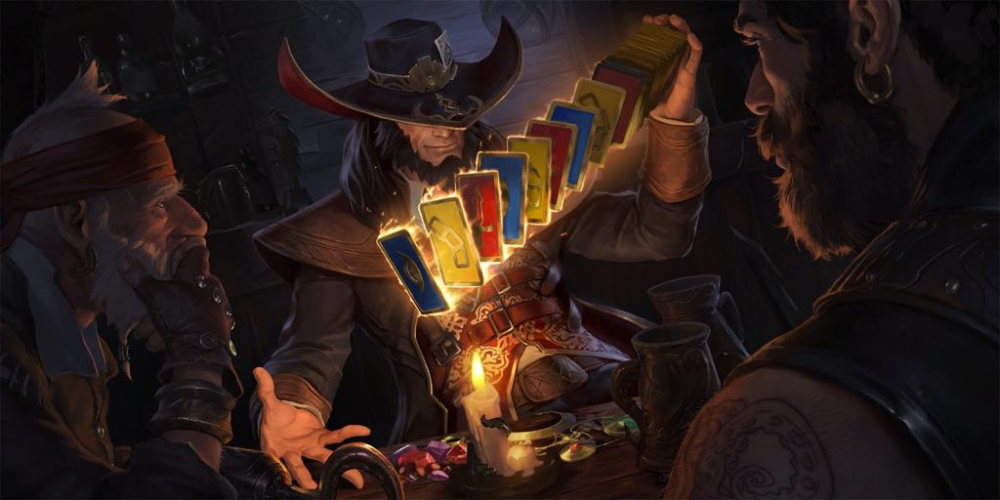

Now that the site is set up, I gotta actually fill it up. I've added some information to the Home and About pages, but I need to add more before I can consider them to 
be complete pages. I also need to start more side projects so I can actually fill up the projects section with stuff. I don't know why, but I really just feel like using Python lately, so I've been looking at some projects I can do in Python. Currently, I've been considering building either a <a href="https://en.wikipedia.org/wiki/Web_scraping" target="_blank">Web Scraper</a> application, or a Discord Bot for Legends of Runeterra (Which is currently one of my favourite games).

<figure>
    
    <figcaption>A picture of Twisted Fate, one of the cards from Runeterra</figcaption>
</figure>

I'll probably post about which ever I decide to do, and some of the logic I'll use in the actual application. Why I picked one option over the other, and why I choose to do things a certain way. Till the next post!